# 曲线和曲面Curves & Surfaces

## 目录结构描述

```
│  curve_editor.exe
│  list.txt
│  raytracer.exe
│  README.md
│  start.bat
│  
├─code
│      arg_parser.h
│      BezierCurve.cpp
│      BezierCurve.h
│      BezierPatch.cpp
│      BezierPatch.h
│      BSplineCurve.cpp
│      BSplineCurve.h
│      Curve.cpp
│      Curve.h
│      glCanvas.cpp
│      glCanvas.h
│      main.cpp
│      matrix.cpp
│      matrix.h
│      Spline.cpp
│      Spline.h
│      spline_parser.cpp
│      spline_parser.h
│      Surface.cpp
│      Surface.h
│      SurfaceOfRevolution.cpp
│      SurfaceOfRevolution.h
│      triangle_mesh.cpp
│      triangle_mesh.h
│      vectors.h
│      work2.cpp
│      
├─image
│      error.png
│      image01.png
│      image02.png
│      image03.png
│      image04.png
│      image05.png
│      image06.png
│      image07.png
│      image08.png
│      image09.png
│      image10.png
│      image11.png
│      image12.png
│      patch_high.png
│      patch_low.png
│      patch_med.png
│      teapot_high.png
│      teapot_low.png
│      torus_high.png
│      torus_low.png
│      vase_high.png
│      vase_low.png
│      vase_very_high.png
│      
├─input
│      spline01_bezier.txt
│      spline02_bspline.txt
│      spline03_bezier.txt
│      spline04_bspline.txt
│      spline05_bspline_dups.txt
│      spline06_torus.txt
│      spline07_vase.txt
│      spline08_bezier_patch.txt
│      spline09_teapot.txt
│      
└─output
        output01_bezier.txt
        output01_bspline.txt
        output02_bezier.txt
        output02_bspline.txt
        output07_edit.txt
        patch_high.obj
        patch_low.obj
        patch_med.obj
        teapot_high.obj
        teapot_low.obj
        torus_high.obj
        torus_low.obj
        vase_high.obj
        vase_low.obj
        vase_very_high.obj
```

## 快速开始

### 环境需求

需要glut32.dll

确保glut32.dll在环境路径中（对于64位一般在C:\Windows\SysWOW64\中）

如果版本不同可能会导致运行失败

### 开始

运行 start.bat

由于环境原因，在我的电脑上raytracer会报错，实际需要raytracer的部分使用3D查看器完成

## 与其他同学讨论与合作

无

## 特别有助于你完成作业的参考资料

计算机图形学 [(美)Peter Shirley等著 高春晓，赵清杰，张文耀译][人民邮电出版社][2007][409页][11840287]

## 已知问题

无

## 附加题

无

## 意见

无

## 示例输出

**这里的事例输入需要文件在同一目录下。**

curve_editor -input spline01_bezier.txt -gui -curve_tessellation 30

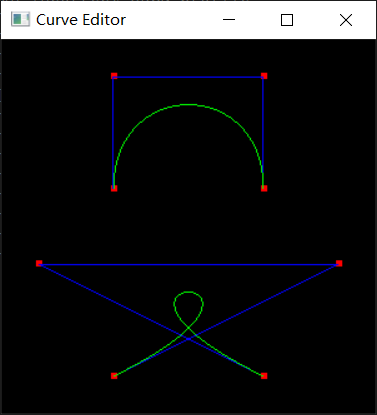

curve_editor -input spline02_bspline.txt -gui -curve_tessellation 30

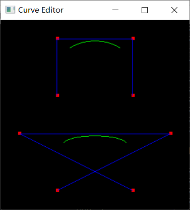

curve_editor -input output01_bezier.txt -gui -curve_tessellation 30

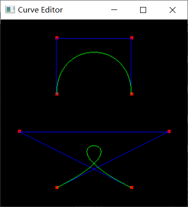

curve_editor -input output01_bspline.txt -gui -curve_tessellation 30

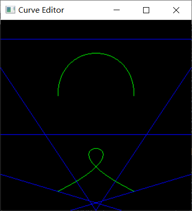

curve_editor -input output02_bezier.txt -gui -curve_tessellation 30

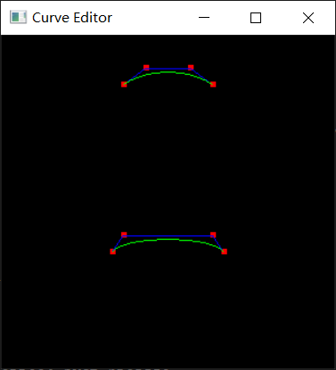

curve_editor -input output02_bspline.txt -gui -curve_tessellation 30


curve_editor -input spline03_bezier.txt -gui -curve_tessellation 30

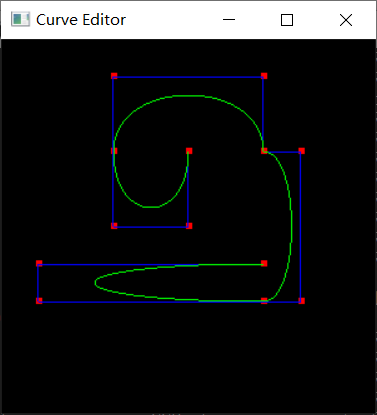

curve_editor -input spline04_bspline.txt -gui -curve_tessellation 30

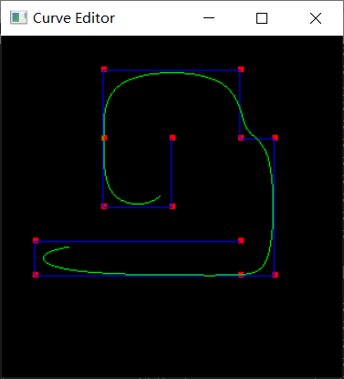

curve_editor -input spline05_bspline_dups.txt -gui -curve_tessellation 30

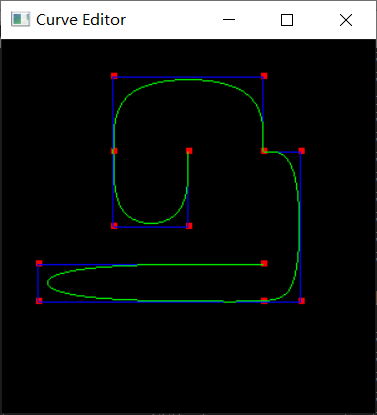

curve_editor -input spline06_torus.txt -curve_tessellation 4 -gui

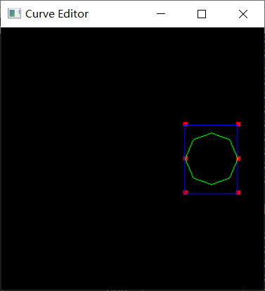

由于我的环境运行不了**raytracer**会报错

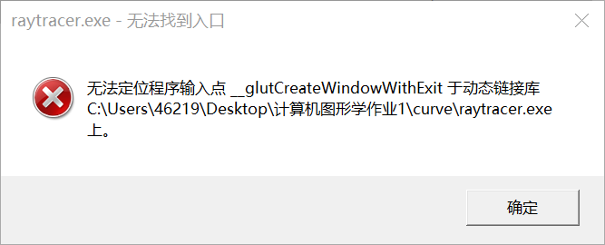

所以都是用win10自带的**3D查看器**查看的

torus_low.obj

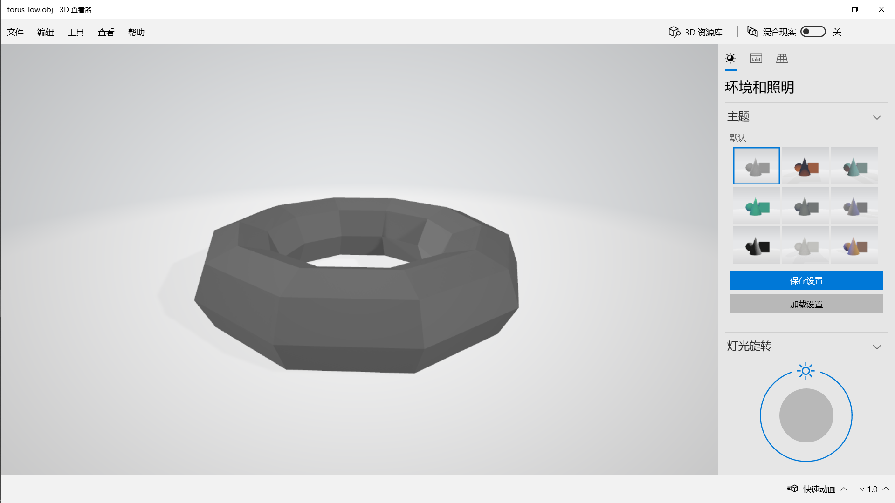

torus_high.obj

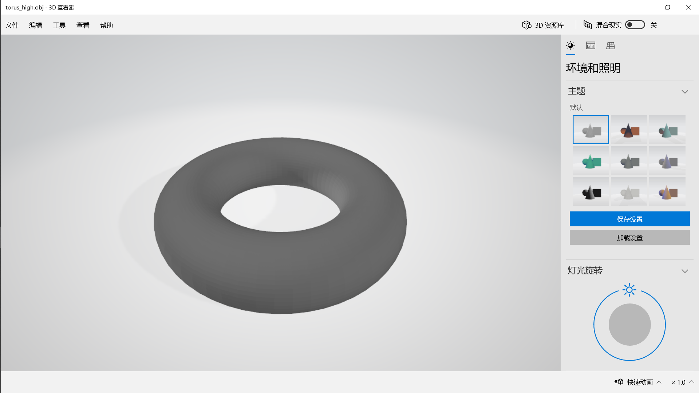

curve_editor -input spline07_vase.txt -curve_tessellation 4 -output_bspline output07_edit.txt -gui


这里有一个加点拖拽成一个花瓶的线，我由于上次没有保存这个图，就不拖了，直接看obj格式的吧。。有点手残

vase_low.obj

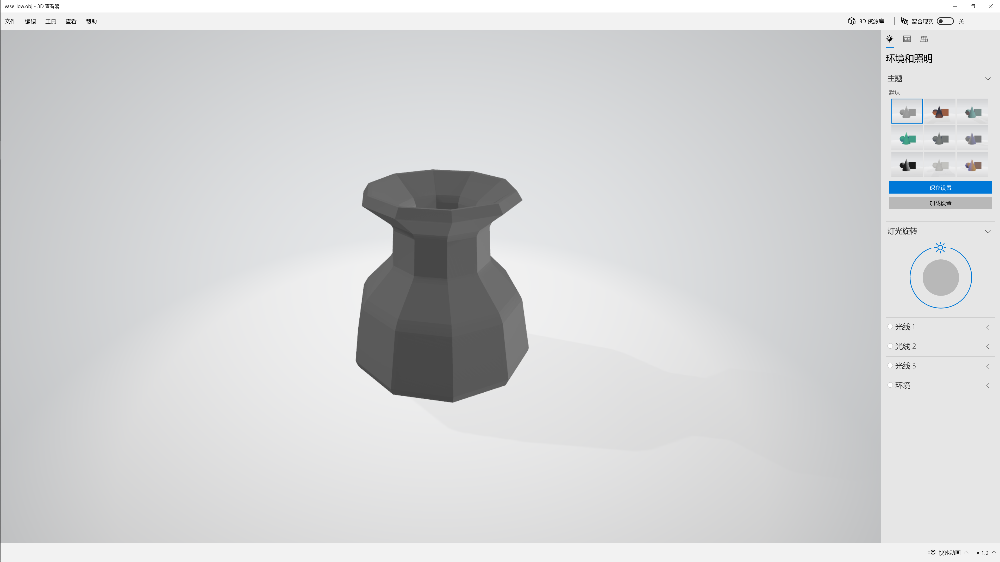

vase_high.obj

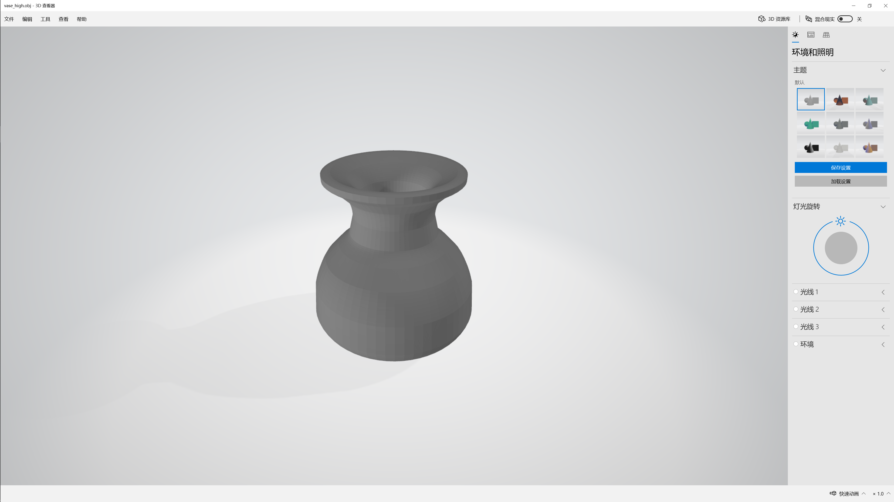

vase_very_high.obj

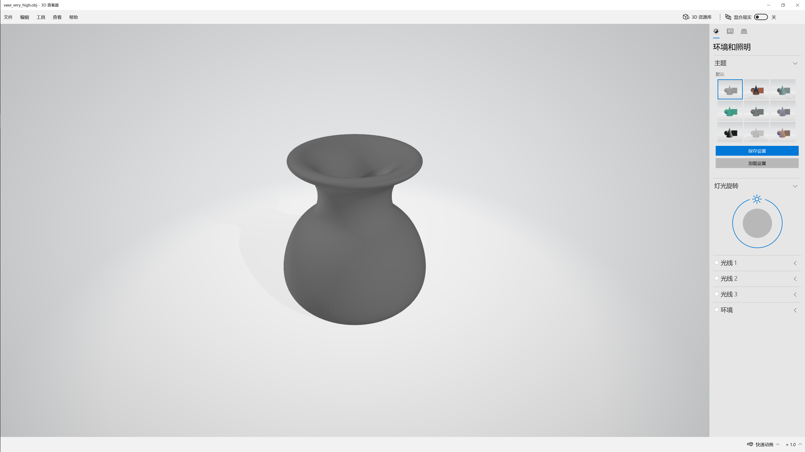

patch_low.obj

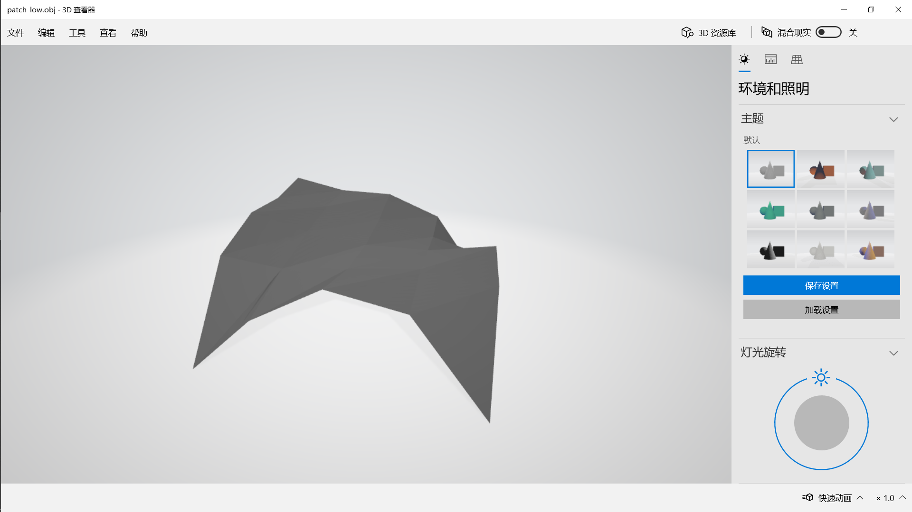

patch_med.obj

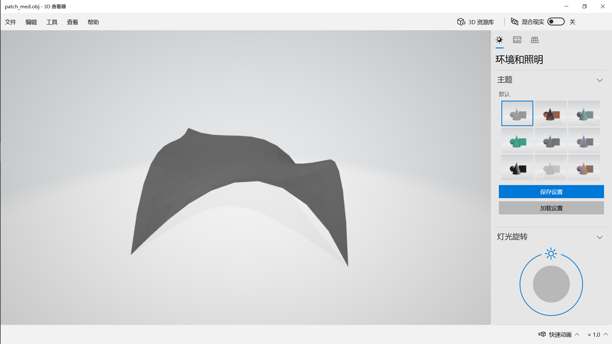

patch_high.obj

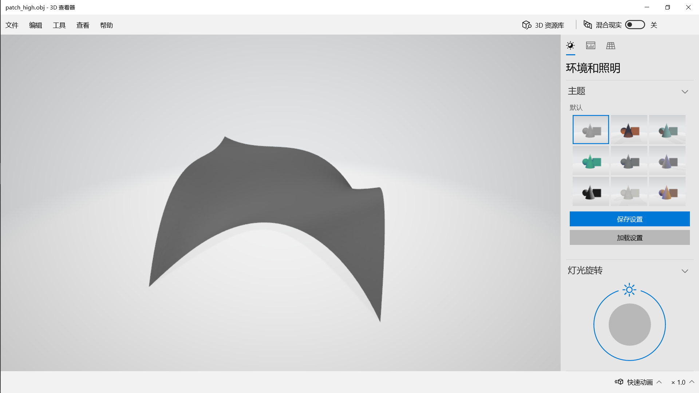

curve_editor -input spline09_teapot.txt -curve_tessellation 4 -gui

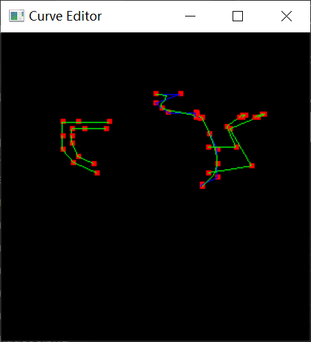

teapot_low.obj

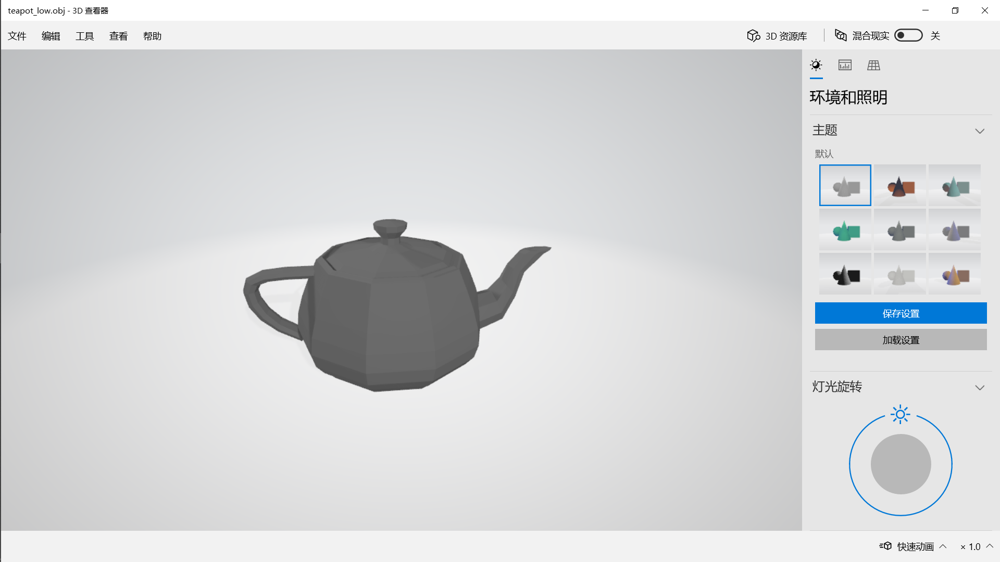

teapot_high.obj


因为raytracer用不了，所以后面两个图看不了

## github地址

https://github.com/Honey634546/Computer-Graphics
