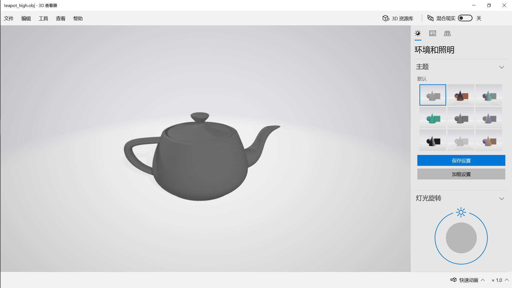

# 曲线和曲面Curves & Surfaces

## 目录结构描述

```
│  curve_editor.exe
│  list.txt
│  raytracer.exe
│  README.md
│  start.bat
│  
├─code
│      arg_parser.h
│      BezierCurve.cpp
│      BezierCurve.h
│      BezierPatch.cpp
│      BezierPatch.h
│      BSplineCurve.cpp
│      BSplineCurve.h
│      Curve.cpp
│      Curve.h
│      glCanvas.cpp
│      glCanvas.h
│      main.cpp
│      matrix.cpp
│      matrix.h
│      Spline.cpp
│      Spline.h
│      spline_parser.cpp
│      spline_parser.h
│      Surface.cpp
│      Surface.h
│      SurfaceOfRevolution.cpp
│      SurfaceOfRevolution.h
│      triangle_mesh.cpp
│      triangle_mesh.h
│      vectors.h
│      work2.cpp
│      
├─image
│      error.png
│      image01.png
│      image02.png
│      image03.png
│      image04.png
│      image05.png
│      image06.png
│      image07.png
│      image08.png
│      image09.png
│      image10.png
│      image11.png
│      image12.png
│      patch_high.png
│      patch_low.png
│      patch_med.png
│      teapot_high.png
│      teapot_low.png
│      torus_high.png
│      torus_low.png
│      vase_high.png
│      vase_low.png
│      vase_very_high.png
│      
├─input
│      spline01_bezier.txt
│      spline02_bspline.txt
│      spline03_bezier.txt
│      spline04_bspline.txt
│      spline05_bspline_dups.txt
│      spline06_torus.txt
│      spline07_vase.txt
│      spline08_bezier_patch.txt
│      spline09_teapot.txt
│      
└─output
        output01_bezier.txt
        output01_bspline.txt
        output02_bezier.txt
        output02_bspline.txt
        output07_edit.txt
        patch_high.obj
        patch_low.obj
        patch_med.obj
        teapot_high.obj
        teapot_low.obj
        torus_high.obj
        torus_low.obj
        vase_high.obj
        vase_low.obj
        vase_very_high.obj
```

## 快速开始

### 环境需求

需要glut32.dll

确保glut32.dll在环境路径中（对于64位一般在C:\Windows\SysWOW64\中）

如果版本不同可能会导致运行失败

### 开始

运行 start.bat

由于环境原因，在我的电脑上raytracer会报错，实际需要raytracer的部分使用3D查看器完成

## 与其他同学讨论与合作

无

## 特别有助于你完成作业的参考资料

计算机图形学 [(美)Peter Shirley等著 高春晓，赵清杰，张文耀译][人民邮电出版社][2007][409页][11840287]

## 已知问题

无

## 附加题

无

## 意见

无

## 部分核心代码

Bspline输出Bezier

```(c++)
void BSplineCurve::OutputBezier(FILE* file)
{
	float Be[16] = { -1,3,-3,1,3,-6,3,0,-3,3,0,0,1,0,0,0 };
	float Bs[16] = { -1,3,-3,1,3,-6,0,4,-3,3,3,1,1,0,0,0 };
	for (int i = 0; i < 16; i++)
	{
		Bs[i] /= 6;
	}
	Matrix Bezier(Be);
	Matrix BSpline(Bs);
	float G1[16] = { vArr[0].x(),vArr[1].x(),vArr[2].x(),vArr[3].x(),vArr[0].y(),vArr[1].y(),vArr[2].y(),vArr[3].y(),0,0,0,0,0,0,0,0 };
	Matrix Geometry(G1);
	Matrix G2;
	if (Bezier.Inverse())
	{
		G2 = Geometry * BSpline * Bezier;
	}
	fprintf(file, "bezier\n");
	fprintf(file, "num_vertices 4\n");
	for (int i = 0; i < 4; i++)
	{
		fprintf(file, "%f %f 0\n", G2.Get(i, 0), G2.Get(i, 1));
	}
}
```

Bezier输出Bspline

```(cpp)
void BezierCurve::OutputBSpline(FILE* file)
{
	fprintf(file, "bspline\n");
	fprintf(file, "num_vertices 4\n");
	float Be[16] = { -1,3,-3,1,3,-6,3,0,-3,3,0,0,1,0,0,0 };
	float Bs[16] = { -1,3,-3,1,3,-6,0,4,-3,3,3,1,1,0,0,0 };
	for (int i = 0; i < 16; i++)
	{
		Bs[i] /= 6;
	}
	Matrix Bezier(Be);
	Matrix BSpline(Bs);
	float G1[16] = { vArr[0].x(),vArr[1].x(),vArr[2].x(),vArr[3].x(),vArr[0].y(),vArr[1].y(),vArr[2].y(),vArr[3].y(),0,0,0,0,0,0,0,0 };
	Matrix Geometry(G1);
	Matrix G2;
	if (BSpline.Inverse())
	{
		G2 = Geometry * Bezier * BSpline;
	}
	for (int i = 0; i < 4; i++)
	{
		fprintf(file, "%f %f 0\n", G2.Get(i, 0), G2.Get(i, 1));
	}
}
```

添加控制点

```(cpp)
void BSplineCurve::addControlPoint(int selectedPoint,float x,float y)
{
	Vec3f temp(x, y, 0);
	vArr.insert(vArr.begin() + selectedPoint, temp);
	num++;
}
```

删除控制点

```(cpp)
void BSplineCurve::deleteControlPoint(int selectedPoint)
{
	if (num <= 4)
	{
		return;
	}
	vArr.erase(vArr.begin() + selectedPoint);
	num--;
	
}
```

输出三角网

```
TriangleMesh* BSplineCurve::OutputTriangles(ArgParser* arg)
{
	int curve_tessellation = arg->curve_tessellation;
	int revolution_tessellation = arg->revolution_tessellation;
	int cnum = curve_tessellation * (num-3)+1;
	TriangleNet* tri = new TriangleNet(revolution_tessellation + 1, cnum - 1);

	vector<Vec3f> arr;
	Vec3f temp;
	for (double j = 0; j < vArr.size() - 3; j++)
	{
		for (double i = 0; i <= curve_tessellation; i++)
		{
			double t = i / num;
			double a1 = pow(1 - t, 3);
			double a2 = 3 * t * t * t - 6 * t * t + 4;
			double a3 = -3 * t * t * t + 3 * t * t + 3 * t + 1;
			double a4 = t * t * t;
			double x = a1 * vArr[j].x() + a2 * vArr[j + 1].x() + a3 * vArr[j + 2].x() + a4 * vArr[j + 3].x();
			double y = a1 * vArr[j].y() + a2 * vArr[j + 1].y() + a3 * vArr[j + 2].y() + a4 * vArr[j + 3].y();
			x /= 6;
			y /= 6;
			temp.Set(x, y, 0.0);
			arr.push_back(temp);
		}
		arr.pop_back();
	}
	arr.push_back(temp);
	for (int i = 0; i < cnum; i++)
	{
		Vec3f t(arr[i].x(), arr[i].y(), arr[i].z());
		for (int j = 0; j <= revolution_tessellation + 1; j++)
		{
			double angle = 360.0 / revolution_tessellation / 180 * M_PI;
			//float t1[16] = { t.x(),t.y(),t.z(),1,0,0,0,0,0,0,0,0,0,0,0,0 };
			//float t2[16] = { cos(angle),0,-sin(angle),0,0,1,0,0,sin(angle),0,cos(angle),0,0,0,0,1 };

			//Matrix temp1(t1);
			//Matrix temp2(t2);
			//Matrix temp3 = temp1 * temp2;
			double x = t.x() * cos(angle) + t.z() * sin(angle);
			double y = t.y();
			double z = t.x() * -1.0 * sin(angle) + t.z() * cos(angle);
			tri->SetVertex(j, i, t);
			//t.Set(temp3.Get(0,0),temp3.Get(1,0),temp3.Get(2,0));
			t.Set(x, y, z);
		}
	}
	return tri;
}
```

## 示例输出

**这里的事例输入需要文件在同一目录下。**

curve_editor -input spline01_bezier.txt -gui -curve_tessellation 30


curve_editor -input spline02_bspline.txt -gui -curve_tessellation 30


curve_editor -input output01_bezier.txt -gui -curve_tessellation 30


curve_editor -input output01_bspline.txt -gui -curve_tessellation 30


curve_editor -input output02_bezier.txt -gui -curve_tessellation 30


curve_editor -input output02_bspline.txt -gui -curve_tessellation 30


curve_editor -input spline03_bezier.txt -gui -curve_tessellation 30


curve_editor -input spline04_bspline.txt -gui -curve_tessellation 30


curve_editor -input spline05_bspline_dups.txt -gui -curve_tessellation 30


curve_editor -input spline06_torus.txt -curve_tessellation 4 -gui


由于我的环境运行不了**raytracer**会报错


所以都是用win10自带的**3D查看器**查看的

torus_low.obj


torus_high.obj


curve_editor -input spline07_vase.txt -curve_tessellation 4 -output_bspline output07_edit.txt -gui


这里有一个加点拖拽成一个花瓶的线，我由于上次没有保存这个图，就不拖了，直接看obj格式的吧。。有点手残

vase_low.obj


vase_high.obj


vase_very_high.obj


patch_low.obj


patch_med.obj


patch_high.obj


curve_editor -input spline09_teapot.txt -curve_tessellation 4 -gui


teapot_low.obj


teapot_high.obj



因为raytracer用不了，所以后面两个图看不了

## github地址

https://github.com/Honey634546/Computer-Graphics