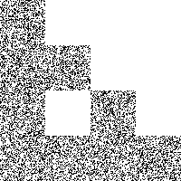

# Assignment 1: Iterated Function Systems

## 目录结构描述

```()
│  ifs.exe
│  list.txt
│  README.html
│  README.md
│  start.bat
│  
├─code
│      ifs.cpp
│      ifs.h
│      image.cpp
│      image.h
│      main.cpp
│      matrix.cpp
│      matrix.h
│      vectors.h
│      
├─image
│      dragon.png
│      fern.png
│      giant_x.png
│      sierpinski_triangle.png
│      sierpinski_triangle_0.png
│      sierpinski_triangle_1.png
│      sierpinski_triangle_2.png
│      sierpinski_triangle_3.png
│      sierpinski_triangle_4.png
│      
├─input
│      dragon.txt
│      fern.txt
│      giant_x.txt
│      sierpinski_triangle.txt
│      
└─output
        dragon.tga
        dragon_0.tga
        dragon_1.tga
        dragon_2.tga
        dragon_3.tga
        dragon_4.tga
        fern.tga
        fern_0.tga
        fern_1.tga
        fern_2.tga
        fern_3.tga
        fern_4.tga
        giant_x.tga
        giant_x_0.tga
        giant_x_1.tga
        giant_x_2.tga
        giant_x_3.tga
        giant_x_4.tga
        sierpinski_triangle.tga
        sierpinski_triangle_0.tga
        sierpinski_triangle_1.tga
        sierpinski_triangle_2.tga
        sierpinski_triangle_3.tga
        sierpinski_triangle_4.tga
```

## 快速开始


运行 start.bat

需要有output文件夹，否则会报错

## 与其他同学讨论与合作

无

## 特别有助于你完成作业的参考资料

计算机图形学 [(美)Peter Shirley等著 高春晓，赵清杰，张文耀译][人民邮电出版社][2007][409页][11840287]

## 已知问题

dragon看起来不太对，不知道应该是什么样子，不过其他三个都对了。

## 附加题

无

## 意见

无

## 部分核心代码

```CPP
void IFS::render(Image& image,float num_points, float num_iters)
{
	Vec3f color(0, 0, 0);
	int width = image.Width();
	int height = image.Height();

	for (int i = 0; i < num_points; ++i)
	{
		Vec2f v = Vec2f(rand() * 1.0f / RAND_MAX, rand() * 1.0f / RAND_MAX);
		for (int j = 0; j < num_iters; j++)
		{
			int k=0;
			float sum = 0;
			float t = rand() * 1.0f / RAND_MAX;
			for (k = 0; k < n; k++)
			{
				sum += this->probability[k];
				if (sum >= t)
					break;
				else if (k == n-1)
					break;
			}
			this->transformation[k].Transform(v);
		}
		if (v.x() >= 0 && v.x() <= 1 && v.y() >= 0 && v.y() <= 1) 
		{
			image.SetPixel((int)(v.x() * width), (int)(v.y() * height),color );
		}
	}

}
```

## 示例输出

**这里的事例输入需要文件在同一目录下。**

ifs -input sierpinski_triangle.txt -points 10000 -iters 0 -size 200 -output sierpinski_triangle_0.tga


ifs -input sierpinski_triangle.txt -points 10000 -iters 1 -size 200 -output sierpinski_triangle_1.tga


ifs -input sierpinski_triangle.txt -points 10000 -iters 2 -size 200 -output sierpinski_triangle_2.tga



ifs -input sierpinski_triangle.txt -points 10000 -iters 3 -size 200 -output sierpinski_triangle_3.tga


ifs -input sierpinski_triangle.txt -points 10000 -iters 4 -size 200 -output sierpinski_triangle_4.tga


ifs -input sierpinski_triangle.txt -points 10000 -iters 30 -size 200 -output sierpinski_triangle.tga


ifs -input dragon.txt -points 10000 -iters 30 -size 200 -output dragon.tga


>**这个图感觉有点问题，不知道原图应该是什么样子，不过看起来怪怪的，不知道对不对**

ifs -input fern.txt -points 10000 -iters 30 -size 200 -output fern.tga


ifs -input giant_x.txt -points 10000 -iters 30 -size 200 -output giant_x.tga


## github地址

https://github.com/Honey634546/Computer-Graphics