# Assignment 2: Ray Casting

## 目录结构描述

```()
│  Assignment2.exe
│  list.txt
│  README.md
│  start.bat
│  
├─code
│      Assignment2.cpp
│      Camera.cpp
│      Camera.h
│      Group.cpp
│      Group.h
│      hit.h
│      image.cpp
│      image.h
│      material.h
│      matrix.cpp
│      matrix.h
│      Object3D.cpp
│      Object3D.h
│      OrthographicCamera.cpp
│      OrthographicCamera.h
│      ray.h
│      SceneParser.cpp
│      SceneParser.h
│      Sphere.cpp
│      Sphere.h
│      vectors.h
│      
├─image
│      depth1_01.png
│      depth1_02.png
│      depth1_03.png
│      depth1_04.png
│      depth1_05.png
│      depth1_06.png
│      depth1_07.png
│      output1_01.png
│      output1_02.png
│      output1_03.png
│      output1_04.png
│      output1_05.png
│      output1_06.png
│      output1_07.png
│      
├─input
│      scene1_01.txt
│      scene1_02.txt
│      scene1_03.txt
│      scene1_04.txt
│      scene1_05.txt
│      scene1_06.txt
│      scene1_07.txt
│      
└─output
        depth1_01.tga
        depth1_02.tga
        depth1_03.tga
        depth1_04.tga
        depth1_05.tga
        depth1_06.tga
        depth1_07.tga
        output1_01.tga
        output1_02.tga
        output1_03.tga
        output1_04.tga
        output1_05.tga
        output1_06.tga
        output1_07.tga
        
```

## 快速开始


运行 start.bat

需要有output文件夹，否则会报错

## 与其他同学讨论与合作

无

## 特别有助于你完成作业的参考资料

计算机图形学 [(美)Peter Shirley等著 高春晓，赵清杰，张文耀译][人民邮电出版社][2007][409页][11840287]

## 已知问题

无

## 附加题

无

## 意见

无

## 部分核心代码

圆求交函数

```cpp
bool Sphere::intersect(const Ray& r, Hit& h, float tmin)
{
	//TODO
	Vec3f origin = r.getOrigin();
	Vec3f direction = r.getDirection();
	float A = direction.Dot3(direction);
	float B = 2 * direction.Dot3(origin - center);
	float C = (origin - this->center).Dot3(origin - center) - radius * radius;
	float deta = B * B - 4 * A * C;
	if (deta < 0)
	{
		return false;
	}
	else
	{
		float t1 = (-B + sqrt(deta)) / (2 * A);
		float t2 = (-B - sqrt(deta)) / (2 * A);
		float t = 0;
		if (t2 >= tmin)
		{
			t = t2;
		}
		else if (t1 >= tmin)
		{
			t = t1;
		}
		else
		{
			return false;
		}
		if (t < h.getT())
		{
			h.set(t, pMaterial, r);
			return true;
		}
	}
	return false;
		
}
```

生成光线函数

```cpp
Ray OrthographicCamera::generateRay(Vec2f point) {
    Vec3f origin = center + (point.x() - 0.5) * size * horizontal + (point.y() - 0.5) * size * up;
    return Ray(origin, direction);
}
```

## 示例输出

**这里的事例输入需要文件在同一目录下。**

raytracer -input scene1_01.txt -size 200 200 -output output1_01.tga -depth 9 10 depth1_01.tga


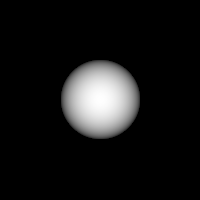

raytracer -input scene1_02.txt -size 200 200 -output output1_02.tga -depth 8 12 depth1_02.tga

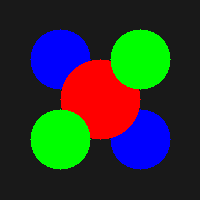
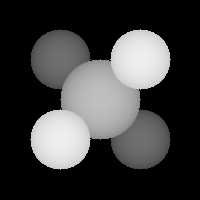

raytracer -input scene1_03.txt -size 200 200 -output output1_03.tga -depth 8 12 depth1_03.tga

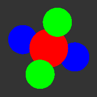
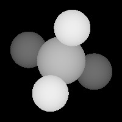

raytracer -input scene1_04.txt -size 200 200 -output output1_04.tga -depth 12 17 depth1_04.tga

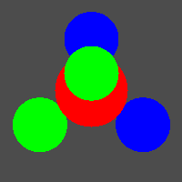
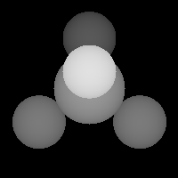

raytracer -input scene1_05.txt -size 200 200 -output output1_05.tga -depth 14.5 19.5 depth1_05.tga

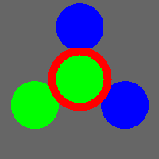
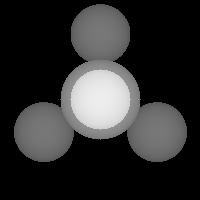

raytracer -input scene1_06.txt -size 200 200 -output output1_06.tga -depth 3 7 depth1_06.tga

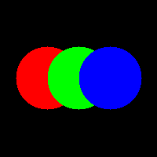
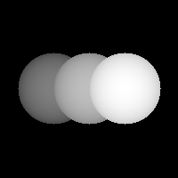

raytracer -input scene1_07.txt -size 200 200 -output output1_07.tga -depth -2 2 depth1_07.tga

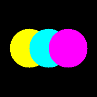


## github地址

https://github.com/Honey634546/Computer-Graphics
